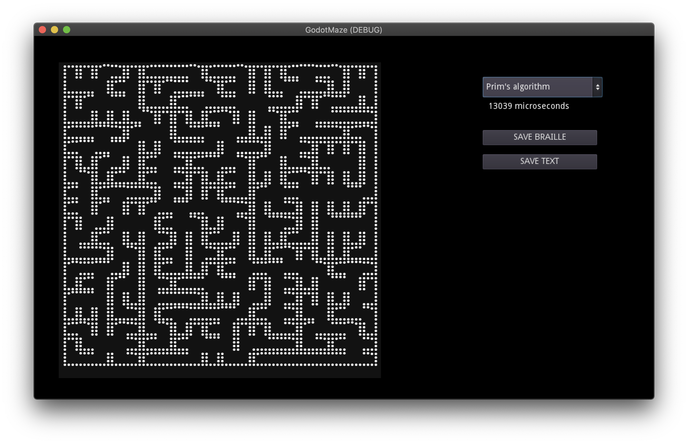

This is based on [LuaMaze](https://github.com/shironecko/LuaMaze), but for Godot. LuaMaze is an awesome set of maze-generation algorithms, written in a very legible and concise format.

I wanted to be able to make all the same maze-types in Godot, and also it's an excellant way to get better with Godot.

Currently, this is just a demo-project to be loaded into Godot, but eventually I hope to make a nice stand-alone tool to generate mazes in several formats (text, tilemap, rectangles, etc.)

